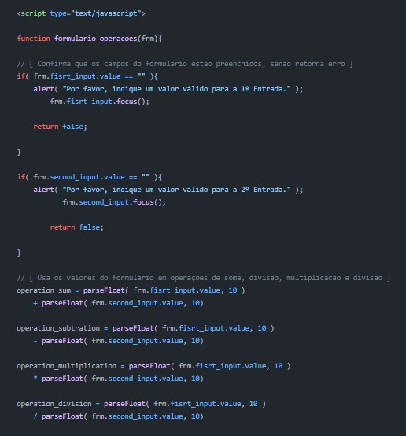
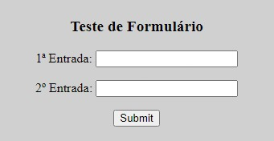

# JavaScript Handbook  


[](https://hits.seeyoufarm.com)

---

Index
======
<!--ts-->
   * [About](#about)
   * [Tools](#tools)
   * [References](#references)
   * [Features](#features)
   * [Layout](#layout)
      * [Testers](#testers)
   * [Pre-requisites](#pre-requisites)
   * [Setup](#setup)
   * [Team](#team)

## About
Este projeto é um compilado de guias e códigos de teste criados para auxliar na introdução ao uso da linguagem JavaScript. 

## Tools
O desenvolvimento desses scripts de teste utiliza as ferramentas abaixo:

- [Visual Studio Code](https://code.visualstudio.com/docs)
- [Git 2.33.1](https://git-scm.com/downloads)

## References

| **Tool**       | **Documentation** 						                               |
|----------------|---------------------------------------------------------------------------------------------|
| Git and GitHub | [Git Documentation](https://git-scm.com/) |
|  JavaScript    | [JavaScript Guide](https://developer.mozilla.org/en-US/docs/Web/JavaScript/Guide)           |
|     HTML       |  [HTML Reference](https://developer.mozilla.org/en-US/docs/Web/HTML/Reference)              |

---

## Features

- [x] Anotações
- [x] Scripts de teste
- [x] Formulários HTML incorporados


## Layout
### Testers
<table class="tg">
<thead>

  <tr>
    <th class="tg-c3ow">Code</th>
    <th class="tg-c3ow">Preview</th>
  </tr>
</thead>
<tbody>
  <tr>
    <td class="tg-c3ow"><br></td>
    <td class="tg-c3ow"><br></td>
  </tr>
</tbody>
</table>

---

## Pre-requisites
Você pode usar uma IDE de navegador como o [Replit](https://replit.com/) ou a [Codeacademy](https://www.codecademy.com/), mas, para uma melhor experiência e aprendizado, considere fazer o [download](https://ninite.com/) de um editor avançado ([Visual Studio Code](https://code.visualstudio.com/download) ou [Eclipse](https://www.eclipse.org/downloads/)).

## Setup
```bash
# Clone esse repositório
$ git clone <https://github.com/vitoriape/algorithm-quickstart>

# Acesse a pasta do projeto
$ cd javascript-handbook

# Utilize a IDE ou o editor de sua preferência para testar
$ start README.md
```

---

## Team
### Contributors
<table>
  <tr>
    <td align="center"><a href="https://github.com/vitoriape"><br /><sub><b>Vitória Peçanha</b></sub></a><br /><a href="https://www.linkedin.com/in/vitoria-pecanha/" title="LinkedIn">🌐</a>   <a href="mailto:vitoriapecanha.log@gmail.com" title="E-mail">📬</a>   <a href="https://translate.habitica.com/user/PenariaToji/" title="Linguists Commonwealth">📜</a></td>   
    <td align="center"><a href="https://github.com/VagnerGusmaoTI"><br /><sub><b>Wagner Gusmão</b></sub></a><br /><a href="https://www.linkedin.com/in/vagnergusmao" title="LinkedIn">🌐</a></td>
  </tr>
</table>
